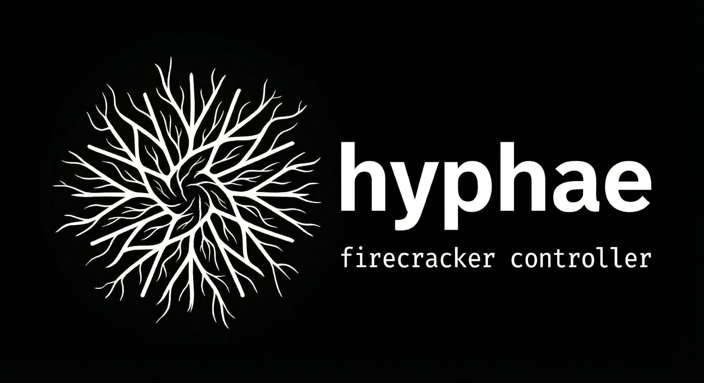
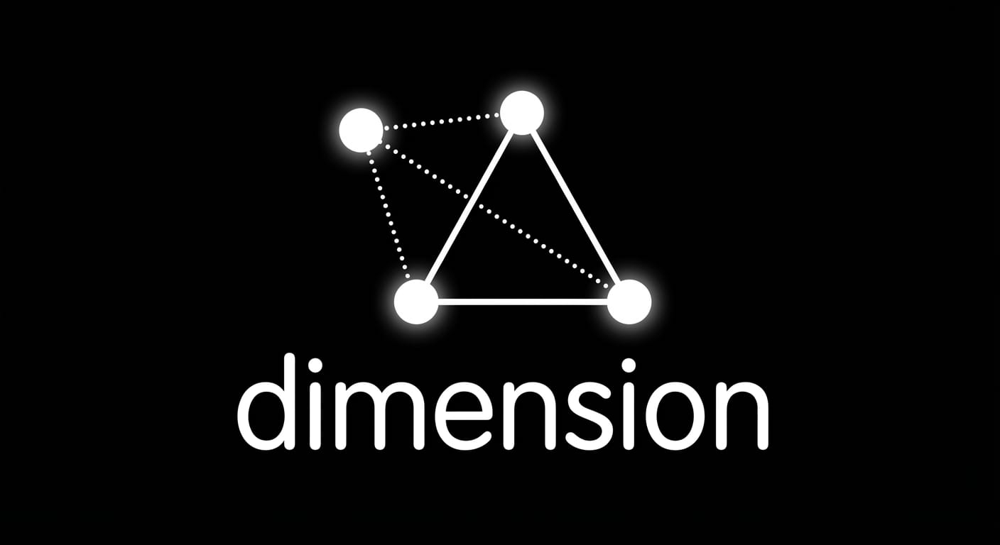

# zprs

Rust monorepo for building and running code inside ephemeral [Firecracker](https://firecracker-microvm.github.io/) microVMs.

---

## Hyphae

<p align="center">
  
</p>

Hyphae is a CLI and library for managing Firecracker microVMs. Given a path to a JavaScript or Rust project, it builds a bootable ext4 root filesystem, generates a Firecracker config, and launches it as a microVM. A built-in SQLite registry tracks images and running VMs so builds are cached and reusable.

### Features

- **Source-to-rootfs** — builds ext4 filesystem images directly from JavaScript or Rust project directories
- **Docker image import** — converts `docker save` tarballs into Firecracker-bootable rootfs images
- **Config generation** — produces Firecracker JSON configs with sane defaults and per-VM overrides
- **Process lifecycle** — spawns, monitors, and gracefully shuts down Firecracker processes
- **Image registry** — embedded SQLite database with content-addressed image storage and cache
- **Kernel management** — downloads, validates, and registers Linux kernels for VM boot
- **Networking** — TAP device setup with automatic IP allocation and optional NAT/masquerade
- **Jailer support** — run VMs in Firecracker's jailer sandbox with cgroup isolation
- **Library-first** — `hyphae-core` can be imported as a crate by other Rust projects

### Usage

```sh
# Check prerequisites (KVM, Firecracker, mkfs.ext4, kernel)
hyphae check

# Build a project into a VM image
hyphae build ./my-app --name myapp

# Launch a microVM
hyphae run myapp --kernel /path/to/vmlinux

# With networking and jailer sandbox
sudo hyphae run myapp --kernel /path/to/vmlinux --network --jail

# Manage VMs
hyphae list bundles
hyphae list vms
hyphae inspect <vm-id>
hyphae stop <vm-id>
```

### How the build works

1. **Staging** — populates a temporary directory with the standard Linux directory tree
2. **Application** — copies project files (JS) or compiled binary (Rust) into `/app`
3. **Init** — embeds `hyphae-init` as `/sbin/init` (PID 1 inside the VM)
4. **Bake** — creates a sized ext4 image via `mkfs.ext4 -d` in a single pass
5. **Registry** — SHA256-hashes and stores the image at `~/.local/share/hyphae/images/`

### What runs inside the VM

Every VM boots into `hyphae-init`, a statically compiled musl binary (PID 1):

1. Mounts `/dev`, `/proc`, `/sys`
2. Reads the entrypoint from `/etc/hyphae/entrypoint`
3. Loads runtime environment variables from `/etc/hyphae/env`
4. Forks and execs the application
5. Triggers reboot on exit (Firecracker exits cleanly)

---

## Dimension

<p align="center">
  
</p>

Dimension is an HTTP gateway that runs agent bundles inside ephemeral Firecracker microVMs. The contract is simple:

**`POST /run` → the agent runs in an isolated VM → results stream out as Server-Sent Events.**

Every application integrates the same way: dispatch a run, then either subscribe to the run's SSE stream directly, or stand up a **bridge** — a small service that dispatches runs on behalf of a platform (Telegram, Slack, cron, another agent), interprets the SSE events, and acts on the results. There is no webhook delivery and no other response channel.

### Architecture

```
Client / Bridge            Dimension Gateway          Worker            Firecracker VM
  │                             │                        │                    │
  │  POST /run                  │                        │                    │
  │  {bundle_id, mode, payload} │   RunInvocation (gRPC) │                    │
  │ ───────────────────────────>│ ──────────────────────>│  spawn VM          │
  │  202 {invocation_id,        │                        │ ──────────────────>│
  │       events_url}           │                        │  vsock Request     │  dimension-agent
  │ <───────────────────────────│                        │ ──────────────────>│  pipes payload to
  │                             │                        │                    │  bundle stdin
  │  GET /runs/{id}/events      │                        │  OutboundMessage   │
  │  (SSE) ────────────────────>│                        │  frames (vsock)    │  bundle emits events
  │                             │   ClickHouse (history) │ <──────────────────│  via dimension.send()
  │  state / bundle events      │ <─ Pulsar (live) ──────│                    │  (UDS → vsock)
  │ <═══════════════════════════│                        │                    │
  │                             │                        │  stdout-final,     │
  │  terminal state event       │                        │  Done → teardown   │
  │ <═══════════════════════════│                        │ ──────────────────>│ ✕
```

- The request `payload` JSON is piped to the bundle's stdin by `dimension-agent` (the in-VM sidecar).
- The bundle emits progress and results with `dimension.send(...)` / `dimension.sendMessage(...)` from `@dimension-agents/shared`; frames travel UDS → vsock → worker, which fans them out to ClickHouse (history) and Pulsar (live).
- The gateway's SSE endpoint replays history from ClickHouse and tails live events from Pulsar, so subscribers can connect late or reconnect with `Last-Event-ID`.
- The bundle's final stdout is captured as the invocation result (returned inline in `sync` mode).

In single-host mode the gateway runs VMs locally; in **multi-host mode** (`DIMENSION_MULTI_HOST=true`) it dispatches to registered workers over gRPC. Workers register via HTTP (`POST /internal/workers/register`).

### API

**`POST /run`** — run a bundle. `mode` is `"sync"` (response contains stdout) or `"async"` (202 with an `events_url` to subscribe to).

```sh
curl -X POST http://localhost:3000/run \
  -H "Content-Type: application/json" \
  -H "Authorization: Bearer $DIMENSION_TOKEN" \
  -d '{
    "bundle_id": "my-agent",
    "mode": "async",
    "payload": {
      "role": "user",
      "content": [{"type": "text", "text": "hello"}],
      "session_id": "1c0e...",
      "history": []
    }
  }'
# → 202 {"invocation_id": "...", "status": "pending", "events_url": "/runs/<id>/events"}
```

**`GET /runs/{id}/events`** — Server-Sent Events stream for a run. `state` events carry lifecycle phases (`completed`, `process_exited`, …); `bundle` events carry whatever the agent sent via `dimension.send(...)`.

```sh
curl -N http://localhost:3000/runs/$RUN_ID/events \
  -H "Authorization: Bearer $DIMENSION_TOKEN" \
  -H "Accept: text/event-stream"
```

**`POST /run/{id}/stop`** — stop a running invocation. **`GET /invocations/{id}`** — invocation status.

**`POST /bundles/push`** / **`POST /bundles/upload`** — publish a bundle (ext4 rootfs or Docker image tar) ([full guide](docs/BUNDLES.md)).

```sh
dimension build -f Dockerfile --name my-agent --push
```

**`GET /health`** — health check endpoint.

Other resources: `/bundles`, `/volumes`, `/named-volumes`, `/sessions/{id}/artifacts`, `/deployments`, and `/admin/*`. See [DEPLOY-GUIDE.md](DEPLOY-GUIDE.md) for the full API reference, [docs/BUNDLES.md](docs/BUNDLES.md) for building bundles, and [docs/BRIDGES.md](docs/BRIDGES.md) for building platform bridges (Telegram, Slack, Discord, etc.).

### Configuration

All flags have environment variable equivalents (`DIMENSION_*`). Key settings:

| Env Var | Default | Description |
|---------|---------|-------------|
| `DIMENSION_TOKEN` | — | Bearer token for API authentication (required) |
| `DATABASE_URL` | — | PostgreSQL connection string (required) |
| `DIMENSION_PORT` | `3000` | Listen port |
| `DIMENSION_HOST` | `0.0.0.0` | Bind address |
| `DIMENSION_KERNEL_PATH` | `/opt/hyphae/kernel/vmlinux` | Kernel for VM boot |
| `DIMENSION_MAX_CONCURRENT` | `200` | Max concurrent VMs |
| `DIMENSION_MOCK` | `false` | Run with mock handler (no real VMs) |
| `DIMENSION_MULTI_HOST` | `false` | Enable multi-host worker routing |

See [DEPLOY-GUIDE.md](DEPLOY-GUIDE.md) for the full configuration reference.

### Wire protocol

Host-guest communication uses length-delimited protobuf over vsock (port 1024). Inside the VM, the bundle talks to `dimension-agent` over a Unix domain socket (`DIMENSION_EVENTS_SOCK`) with length-prefixed JSON frames — the agent SDK's `dimension.send(...)` handles this.

| Message | Direction | Purpose |
|---------|-----------|---------|
| `Request` | Host → Guest | JSON payload, piped to the bundle's stdin |
| `OutboundMessage` | Guest → Host | Bundle events (`bundle`), stdout (`stdout-final`), stderr lines |
| `Done` | Guest → Host | Stream completion signal |

### Lifecycle

1. Validate prerequisites (kernel, bundles in registry)
2. Bind HTTP listener, run database migrations
3. On `POST /run`: acquire concurrency permit → dispatch to worker (or local) → spawn VM → deliver payload over vsock → fan out guest events to ClickHouse + Pulsar → serve them as SSE → tear down VM on exit
4. On shutdown (SIGTERM/SIGINT): stop accepting, drain active streams, reap orphan VMs

---

## Project Structure

```
crates/
  hyphae/              CLI binary — clap-based argument parsing
  hyphae-core/         Library — config, process, rootfs, registry, kernel, net, jail
  hyphae-errors/       Shared error types with structured error codes
  hyphae-init/         Init process compiled into VM root filesystems (musl static)
  dimension-gateway/   HTTP server — axum, POST /run + SSE, VM orchestration
  dimension-worker/    gRPC server — runs invocations, spawns Firecracker VMs,
                       fans out run events to ClickHouse + Pulsar
  dimension-store/     PostgreSQL storage — sessions, messages, users, tasks, artifacts
  dimension-agent/     Guest agent — vsock ↔ bundle bridge (stdin payload, event UDS)
  dimension-protocol/  Protobuf codec and wire types
  dimension-cli/       CLI client — build/push bundles, run, sessions, admin
agents/
  packages/shared/     @dimension-agents/shared — agent SDK (runAgent, tools,
                       dimension.send outbound events)
  packages/*           TypeScript agent bundles (coder, planner, translator, …)
telegram-bridge/       Telegram Bot API ↔ Dimension bridge (TypeScript, SSE consumer)
docs/
  BUNDLES.md           Guide: building and deploying bundles
  BRIDGES.md           Guide: building platform bridge apps
  a2a.md               Design: inter-agent dispatch (in flight)
  archive/             Superseded planning docs
```

## Prerequisites

- Linux with KVM enabled (`/dev/kvm`)
- [Firecracker](https://firecracker-microvm.github.io/) binary in `$PATH`
- `mkfs.ext4` (from e2fsprogs)
- A Linux kernel image (`vmlinux`) compatible with Firecracker
- PostgreSQL (for Dimension gateway)

## Building

```sh
# Build everything
cargo build --release

# Build only the gateway (binary: dimension-server)
cargo build --release -p dimension-gateway

# Build the worker (binary: dimension-worker)
cargo build --release -p dimension-worker

# Build the guest agent (static musl binary for inside the VM)
cargo build --release --target x86_64-unknown-linux-musl -p dimension-agent

# Build the hyphae CLI
cargo build --release -p hyphae

# Build the Telegram bridge (TypeScript)
cd telegram-bridge && npm install && npm run build

# Build the agent bundles (pnpm workspace)
cd agents && pnpm install && pnpm -r build
```

## License

MIT
